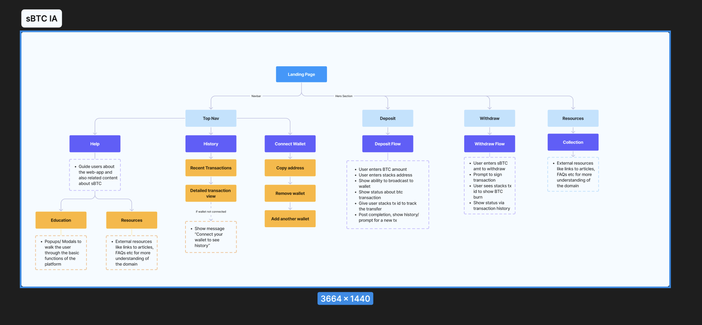
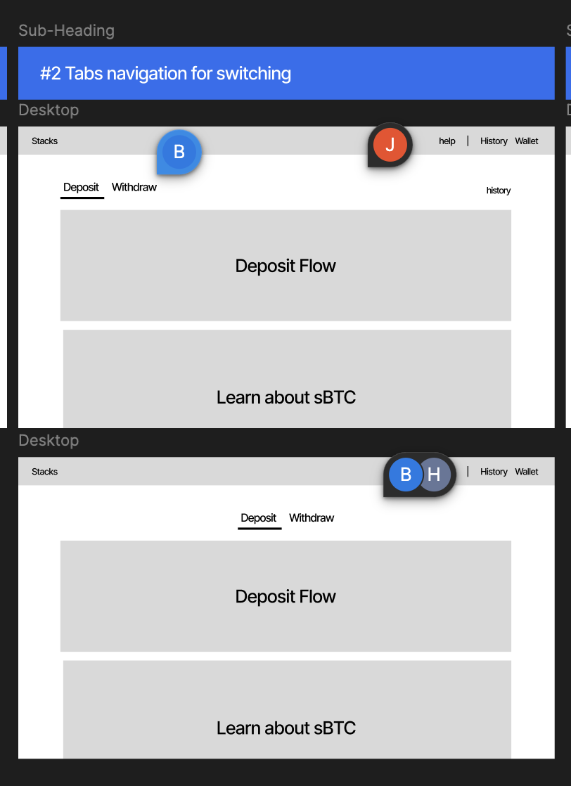
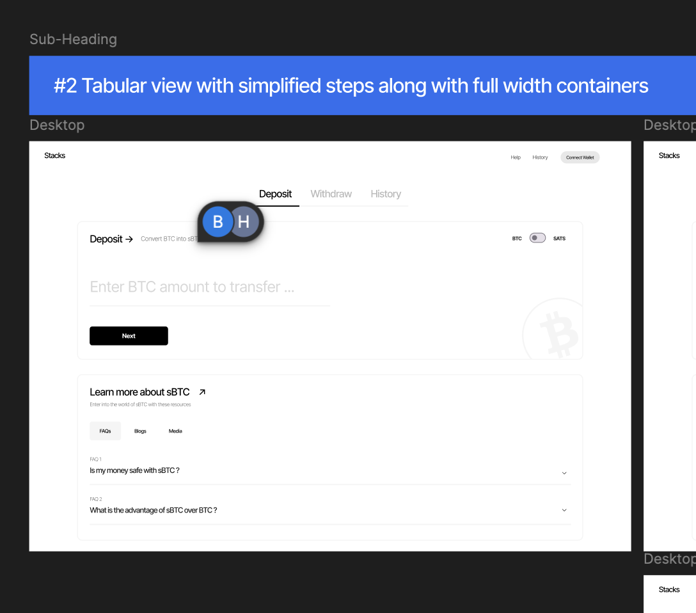
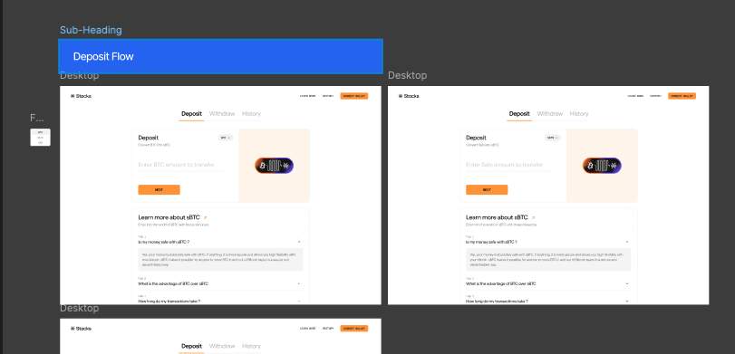
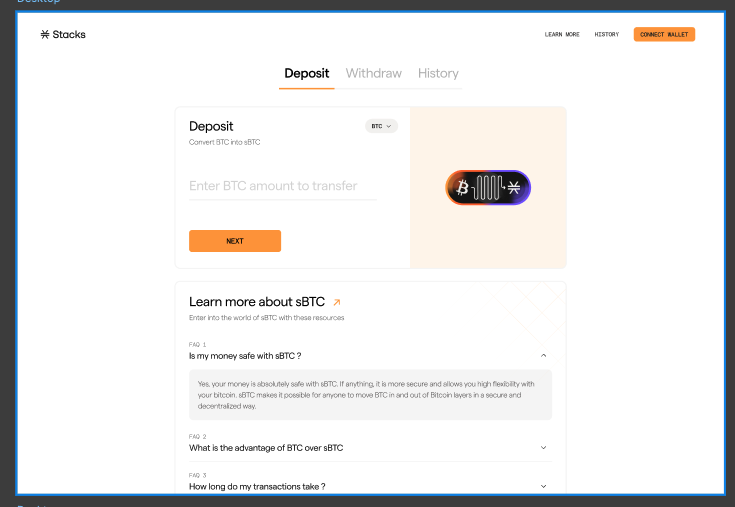
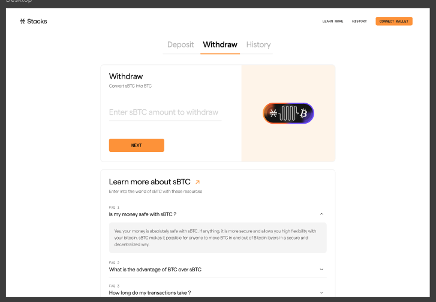
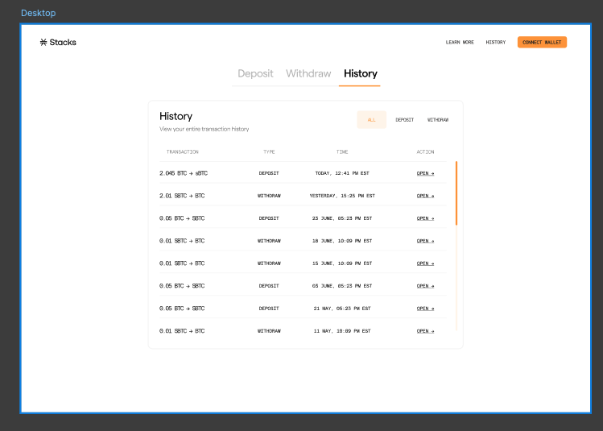
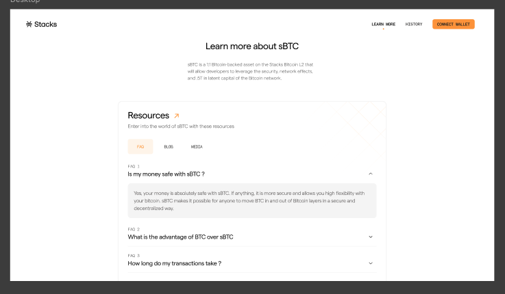

# Design

This page will be used as a collection of information that paints a picture of reason for our design decision and direction. This is intended for open communication and any thought or comments in regards to a decision or direction would be highly appreciated if not expected.

The sections that follow give a brief description of the document or link that encapsulates it.

## Information Architecture

[sBTC Bridge High Level Overview](https://docs.google.com/document/d/1MQYRdcbnE6RFMTAZTeKD3lO1tJqdyIl0mlKMMZjevng/edit)

Above details the high level flow map for how a user will complete their journey goals (ex make a deposit)

- With an weight to keep things simple the landing page with lean towards having two even call to actions (Deposit & Withdraw) for simplicity.
- Seeing the History will be through the navigation since this is action we assume new users won't be interested in till after doing 1/2 call to actions (subject to be changed).

## Layout Explorations

[Design](https://www.figma.com/design/n8jnoLE1WFTgvaBDI8wZqc/sBTC?node-id=20-93&t=WrRUjgMpDNw0Zk90-4)

Working through layouts that amplify simplicity and guidance we've favored a single column layout for the landing page that will show some sub navigation to switch easily between Deposit and Withdraw flow

For the curious there are also iterations for step by step guidance [tooltips](https://www.figma.com/design/n8jnoLE1WFTgvaBDI8wZqc/sBTC?node-id=33-110&t=WrRUjgMpDNw0Zk90-4) if the user would require

## Grayscales

[Designs](https://www.figma.com/design/n8jnoLE1WFTgvaBDI8wZqc/sBTC?node-id=74-736&t=WrRUjgMpDNw0Zk90-4)

Working through our first landing page grayscale iterations.

- Current Fav: A center sub nav which would allow the user to easily switch between actions.
- Notice the sub title to the bottom left of the sub nav, "Deposit -> Convert BTC.." this tells the user how many further steps there are in order to complete this action.

## High Fidelity Screens

[Designs](https://www.figma.com/design/n8jnoLE1WFTgvaBDI8wZqc/sBTC?node-id=227-1143&t=8GSqmd0GHFctMsQO-4)

### Deposit

### Withdraw

### History

### Learn More

