# Sponsorship API

This document holds details towards requirements, architecture, high level API documentation

## Requirements

The need for a sponsorship api arose from wanting to prevent Signer from the burden of paying for transaction fee on withdraw request. Will not limited to just STX fees the sponsorship API will focus on the stacks side first.

### User Story

A Signer should be able to make a POST API request to the Sponsorship API with a serialized transaction as a parameter.

The Sponsorship API should be able to consume the transaction, sign the transaction on behalf of the sponsoring wallet, add the appropriate amount of fee for the transaction size & return the signed serialized transaction.



## Architecture

Following the footsteps of the Emily API, this will be hosted on AWS.

Three AWS resources that we'll depend on

1. API Gateway
2. Lambda
3. Secrets Manager

### API Gateway

Will manage the allowed called based on some API key. This will take care of the authentication logic for who is allowed to use the API

### Lambda

Serverless logic for easy deployment and management of the Sponsorship API business logic

### Secrets Manager

Will handle storing the sponsoring wallet private keys.

## API

The API will expose only one POST request route

### POST: /sponsor

#### Body Parameters

- `serializedTransaction`: serialized stx transaction

#### Authorization

- Bearer Token in header

```curl
curl -X POST https://stxSponsorshipAPI.com/sponsor \
-H "Authorization: Bearer YOUR_BEARER_TOKEN" \
-H "Content-Type: application/json" \
-d '{
  "serializedTransaction": "YOUR_SERIALIZED_STX_TRANSACTION"
}'
```
